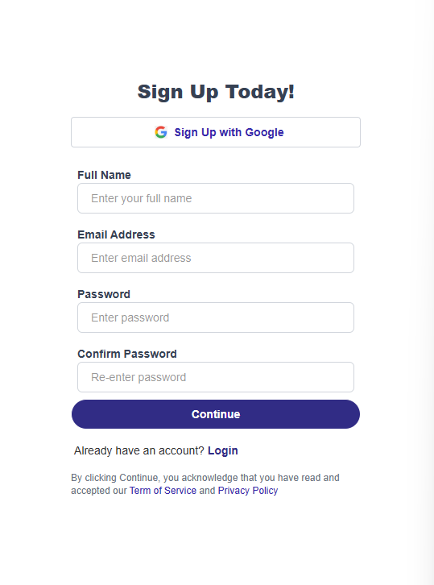

# User Authentication with NextAuth

This is a user authentication system built using Next.js and NextAuth.  
It includes Signup, Login, and Email Verification features, integrated with a backend API.

## Screenshots

### Signup Page



### Login Page


### Verify Email Page


## Features

- Signup, Login, and Verify Email pages
- Integration with external API endpoints
- Form validation and error handling
- Clean and responsive user interface

## How to run

1. Clone the repository

2. Create _.env.local_ file and Add GoogleAPI id and secret number from Google Cloud.

3. Run these commands

```bash
cd your-project-folder
npm install
npm run dev
```
